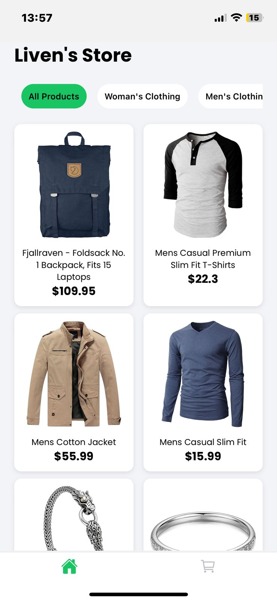
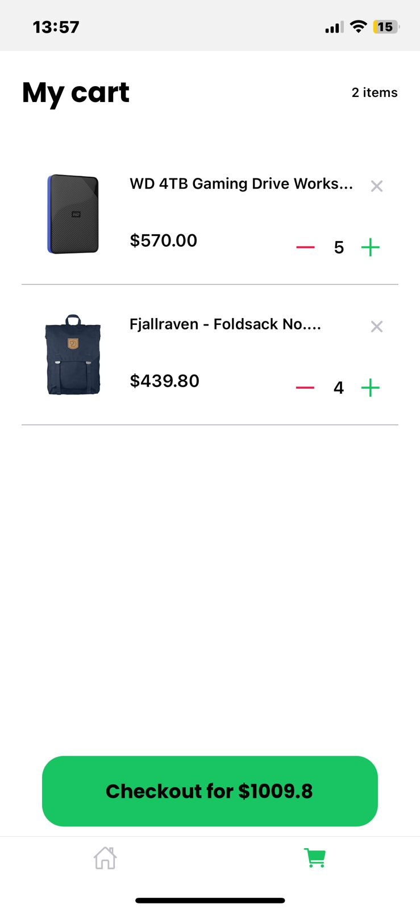

# Liven's Store

Aplicativo desenvolvido em ReactNative, para teste técnico da Liven. Se trata de uma loja que lista os produtos e possibilita o cliente adicionar ao carrinho. No carrinho é possível ver os produtos adicionados e modificar suas quantidades.

A API usada foi https://fakestoreapi.com/docs

## Screenshots

    

        
    

    

        
    

